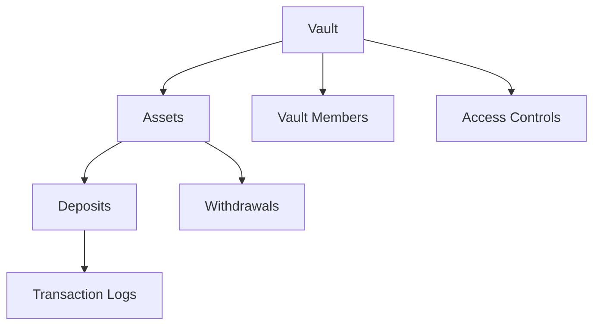

# CoreVault: Decentralized Asset Management

A secure, transparent asset management and vault system built on the Stacks blockchain, providing robust security and flexible access controls.

## Overview

CoreVault is a comprehensive asset management solution that enables:
- Secure, decentralized vault creation and management
- Fine-grained access control and role-based permissions
- Immutable transaction and deposit tracking
- Multi-signature vault support
- Transparent and auditable asset movements

## Architecture

CoreVault implements a flexible and secure vault management system:



Core Components:
- Vaults: Secure containers for managing digital assets
- Assets: Tracked deposits and withdrawals
- Vault Members: Participants with configurable access rights
- Access Controls: Role-based permissions and transaction validation

## Contract Documentation

### Main Contract: vault-core.clar

#### Vault Roles
- `ROLE-OWNER` (1): Full vault management rights
- `ROLE-ADMIN` (2): Advanced management permissions
- `ROLE-CONTRIBUTOR` (3): Limited deposit/withdrawal access
- `ROLE-VIEWER` (4): Read-only access

#### Transaction Status
- `STATUS-PENDING` (1)
- `STATUS-APPROVED` (2)
- `STATUS-REJECTED` (3)
- `STATUS-COMPLETED` (4)

## Getting Started

### Prerequisites
- Clarinet
- Stacks wallet
- Basic understanding of blockchain concepts

### Quick Start

1. Create a vault:
```clarity
(contract-call? .vault-core create-vault 
    "Team Treasury" 
    "Collaborative asset management vault")
```

2. Add vault member:
```clarity
(contract-call? .vault-core add-vault-member 
    u1 
    'ST1PQHQKV0RJXZFY1DGX8MNSNYVE3VGZJSRTPGZGM 
    u2)
```

3. Deposit assets:
```clarity
(contract-call? .vault-core deposit-asset 
    u1 
    u100 
    "STX")
```

## Core Functions

### Vault Management
```clarity
(create-vault (name (string-ascii 100)) (description (string-utf8 500)))
(add-vault-member (vault-id uint) (member principal) (role uint))
```

### Asset Management
```clarity
(deposit-asset (vault-id uint) (amount uint) (asset (string-ascii 10)))
(withdraw-asset (vault-id uint) (amount uint) (asset (string-ascii 10)))
(propose-transaction (vault-id uint) (recipient principal) (amount uint))
```

## Development

### Testing
1. Clone repository
2. Install dependencies: `clarinet install`
3. Run tests: `clarinet test`

### Local Development
1. Start local chain: `clarinet console`
2. Deploy contract
3. Interact via Clarity console

## Security Considerations

1. Access Control
- Strict, hierarchical role-based permissions
- Multi-signature transaction approval
- Comprehensive audit logging

2. Risk Mitigation
- Transaction proposal and approval workflow
- Configurable member roles
- Immutable transaction records

3. Limitations
- Maximum vault members per vault
- Transaction size and frequency constraints
- Asset type restrictions

## Compliance & Transparency

CoreVault is designed with transparency and regulatory compliance in mind, providing verifiable, auditable asset management on the Stacks blockchain.# CoreVault: Decentralized Asset Management

A secure, transparent asset management and vault system built on the Stacks blockchain, providing robust security and flexible access controls.

## Overview

CoreVault is a comprehensive asset management solution that enables:
- Secure, decentralized vault creation and management
- Fine-grained access control and role-based permissions
- Immutable transaction and deposit tracking
- Multi-signature vault support
- Transparent and auditable asset movements

## Architecture

CoreVault implements a flexible and secure vault management system:


Core Components:
- Vaults: Secure containers for managing digital assets
- Assets: Tracked deposits and withdrawals
- Vault Members: Participants with configurable access rights
- Access Controls: Role-based permissions and transaction validation

## Contract Documentation

### Main Contract: vault-core.clar

#### Vault Roles
- `ROLE-OWNER` (1): Full vault management rights
- `ROLE-ADMIN` (2): Advanced management permissions
- `ROLE-CONTRIBUTOR` (3): Limited deposit/withdrawal access
- `ROLE-VIEWER` (4): Read-only access

#### Transaction Status
- `STATUS-PENDING` (1)
- `STATUS-APPROVED` (2)
- `STATUS-REJECTED` (3)
- `STATUS-COMPLETED` (4)

## Getting Started

### Prerequisites
- Clarinet
- Stacks wallet
- Basic understanding of blockchain concepts

### Quick Start

1. Create a vault:
```clarity
(contract-call? .vault-core create-vault 
    "Team Treasury" 
    "Collaborative asset management vault")
```

2. Add vault member:
```clarity
(contract-call? .vault-core add-vault-member 
    u1 
    'ST1PQHQKV0RJXZFY1DGX8MNSNYVE3VGZJSRTPGZGM 
    u2)
```

3. Deposit assets:
```clarity
(contract-call? .vault-core deposit-asset 
    u1 
    u100 
    "STX")
```

## Core Functions

### Vault Management
```clarity
(create-vault (name (string-ascii 100)) (description (string-utf8 500)))
(add-vault-member (vault-id uint) (member principal) (role uint))
```

### Asset Management
```clarity
(deposit-asset (vault-id uint) (amount uint) (asset (string-ascii 10)))
(withdraw-asset (vault-id uint) (amount uint) (asset (string-ascii 10)))
(propose-transaction (vault-id uint) (recipient principal) (amount uint))
```

## Development

### Testing
1. Clone repository
2. Install dependencies: `clarinet install`
3. Run tests: `clarinet test`

### Local Development
1. Start local chain: `clarinet console`
2. Deploy contract
3. Interact via Clarity console

## Security Considerations

1. Access Control
- Strict, hierarchical role-based permissions
- Multi-signature transaction approval
- Comprehensive audit logging

2. Risk Mitigation
- Transaction proposal and approval workflow
- Configurable member roles
- Immutable transaction records

3. Limitations
- Maximum vault members per vault
- Transaction size and frequency constraints
- Asset type restrictions

## Compliance & Transparency

CoreVault is designed with transparency and regulatory compliance in mind, providing verifiable, auditable asset management on the Stacks blockchain.